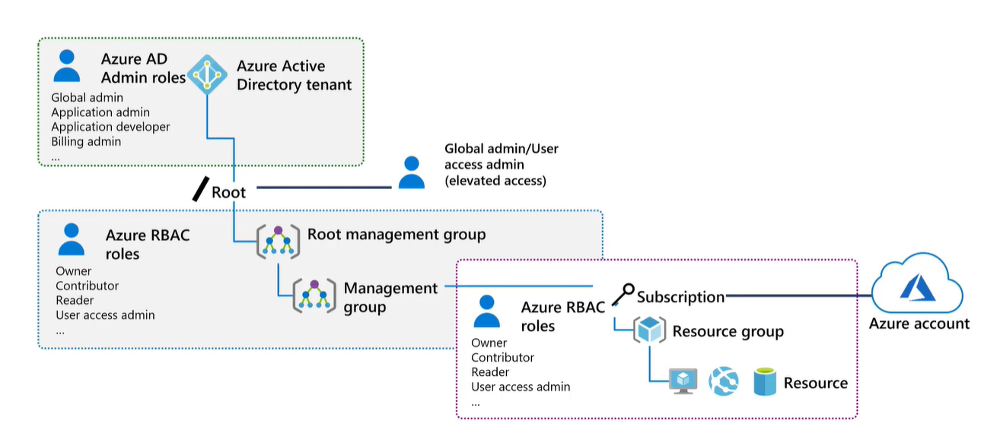
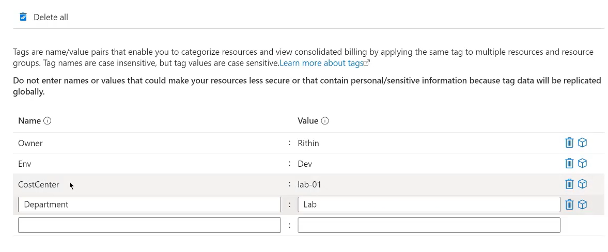
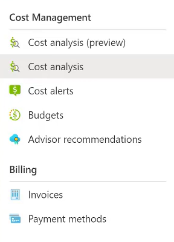
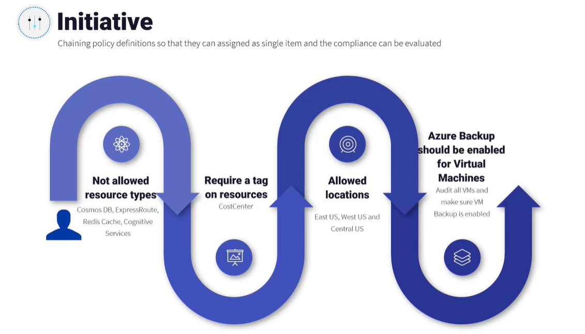
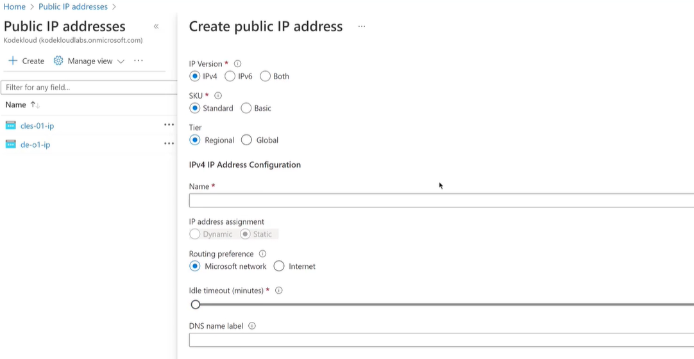
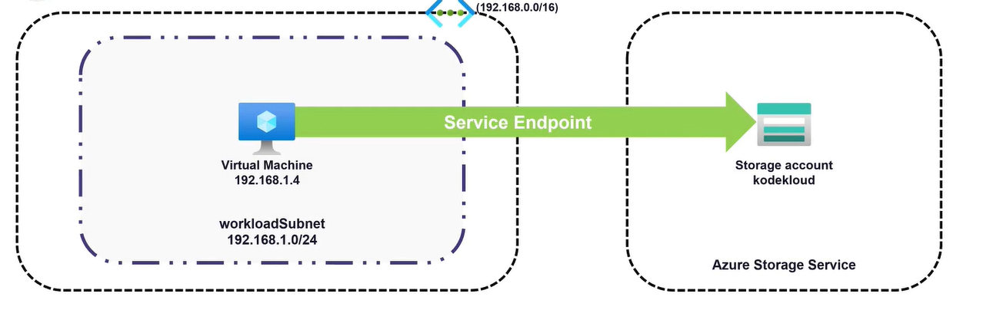
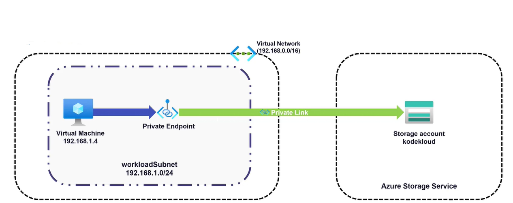

- Managing Azure Active Directory
  collapsed:: true
	- How to use Azure to secure your identities and understand how users and groups are implemented in Azure AD.
	- Azure Active Directory
	  collapsed:: true
		- Cloud based identity and directory management service enabling access to Azure services and other SaaS solutions like Microsoft 365, DropBox, Salesforce etc.
		- Self service options like password reset, authentication, SSO, device management, hybrid identities etc. On-prem applications etc.
		- AD concepts
			- Identity  - Object that can be authenticated. User, group or service principals (service accounts)
			- Account - Associate data attributes to an identity we call it account. Example location, department and phone number of user makes that identity an Account.
			- Azure AD Account  - Accounts created in Azure AD is called Azure AD account
			- Azure AD Tenant or directory - Dedicated instance of Azure AD that is created during sign up of any Microsoft cloud service subscription. Tenant and Directory means same. We can have one or multiple directories based on requirement.
		- Azure AD vs Active Directory Domain Services (ADDS)
		  collapsed:: true
			- Two different services. Installing ADDS in Azure is not Azure AD
			- Azure AD is cloud based or web based , so its queried using HTTP or HTTPS. ADDS using LDAP protocol for querying
			- AZ AD uses SAML, WS-Federation, Open ID and OAuth for authorization. ADDS uses KERBEROS for authentication
			- AZ AD Federation can be set up with 3rd party providers like Facebook v/s ADDS , Federation is only to other domains, 3rd party not supported.
			- Azure AD is managed service offering v/s ADDS will run on VMs or Physical Windows Servers.
		- Azure AD Editions
			- Premium P2 - No directory object limit, Single Sign on, B2B collab, O365 access, Hybrid identities, Conditional access, identity Protection, Identity Governance.
			- Premium P1 -No directory object limit, Single Sign on, B2B collab, O365 access, Hybrid identities, Conditional access
			- M365 Apps - No directory object limit, Single Sign on, B2B collaboration, O365 access
			- FREE - included with Azure Subscription - No directory object limit, Single Sign on, B2B collaboration.
		- User Accounts
		  collapsed:: true
			- User accounts are used for authentication and authorization.  All users must have an account
			- Each user can have optional properties.
			- All users can be accessed from Azure Active Directory > USERS > All users
			- We can perform bulk operations like bulk create, bulk invite and bulk delete.
			-
			- Types of Identities -
			- Cloud Identities - Users exist only in  internal Azure AD or external Azure AD
			- Guest Users - Exist outside of Azure , Microsoft accounts, Live Accounts etc.
			- Directory synchronized users - These users are synchronized from your on-prem Windows AD. We cannot create directory synchronized users (obvious)
			- REFER USER CREATION LAB HERE IN AZURE AD.
			-
		- User Accounts - Bulk Operations 
		  collapsed:: true
			- Bulk operations will let you download a CSV template where you add users you want to create, delete or invite.
			  BULK CREATE
			  BULK INVITE
			  BULK DELETE
			  BULK DOWNLOAD
			- Azure Active Directory > Users - you will see Bulk Operations option, download CSV Template
			- You can restore DELETED users by going to Users > Deleted users option
	- Azure AD Join
		- We can uses Azure AD join to manage our corporate assets (similar to domain join in ADDS)
		- IT admins make sure devices are secure and follow security standards
		- Azure AD join offers SINGLE SIGN ON - app services and SAAS solutions
		- Provides Access to Microsoft Store for Business
		- Enterprise state Roaming - sync all your config across devices
		- Windows Hello - Sign in using biometric or facial sign in
		- Device Management - Admins can check complaince and restric
		- On-prem Access - Seamless access to on-prem apps and leverage single sign on
	- Self-Service Password Reset (SSPR)
	  collapsed:: true
		- Enables users to reset password without need to call IT helpdesk
		- Setup Multiple methods to reset
		- Premium P2 license
		- Enable for all users or targeted users
		- Admin accounts - enabled by default. 
		  
		  STEP 1 - Enable SSPR for all or targeted users
		  STEP 2 - Set up number of authentication methods required for reset of password
		  STEP 3 - Users will be requested to register for SSPR next time login and enable reset method
		-
		- REFER SSPR LAB Azure Active Directory > Password Reset > go to properties , options available none, selected, all
		- If a user wants to setup up his/her profile , they can go to aka.ms/ssprsetup and they will be able to setup their SSPR reset options. Methods available are Authenticator app / phone etc.
		- If user wants to reset password they can go to --> aka.ms/sspr > redirects to passwordreset.microsoftonline.com
		-
		-
	- Group Accounts
	  collapsed:: true
		- Security groups -> assign a role, inherited by all users of group
		- MS 365 groups -> offers collab. opportunities
		  
		  Membership Assignment Types
		- Assigned - default
		- Dynamic users - attribute of users changed, AZ will check and modify/remove
		  --> Check Dynamic Membership rules under group. specify your query/expression here
		- Dynamic device - will dynamically check device properties and will remove if attributes match remove rule. Not available for MS 365 groups
		-
	- Multi-Tenant Environments
	  collapsed:: true
		- Each Tenant or directory represents an organization. An org can have one or more tenants.
		- Azure AD there is no parent child relationship
		- Each Azure AD org is fully independent. Each tenant is considered separate
		- Resource Independence - Creation and deletion of resource in one Tenant does not have any impact on another tenant.
		- Administration independence - Level of permission of user account is only valid within the tenant
		- Synchronization independence - Each Azure AD Tenant's synchronization of accounts can be independently set up for each tenant.
		- Default domain provided yourorg.onmicrosoft.com , you can bring your custom domain names need to set up DNS
		- You can switch between directories (tenants)
		- You need an invite from Tenant admin to join another Tenants.
	-
- Azure Subscriptions
  collapsed:: true
	- Need subscription to create resources. All charges of all resources made are charged to subscription.
	  Hence Azure subscription acts like a billing boundary for usage.
	- Resources deployed are mapped to Azure Subscription
	- Help us set up environmental boundaries - Dev, TEST , QA etc
	- Every subscription has unique subscription ID.
	- An account can have multiple subscriptions
	- Any identity part of Azure AD or trusted MS Cloud service can sign up for a subscription.
	- Different types
		- Enterprise Agreements - 500 or more users and devices. Offers services and licensing at discounted rates. Pre payment required
		- Pay-as-you-go subscription - Ideal for small size org. Monthly billing
		- CSP - Cloud Solution Provider - Licensed by microsoft partner. managed by Microsoft partners
		- Free Trial - $200 credit for 30 days and free limited access for 12 months
		- Azure for Students
		- Visual Studio subscription
	- Subscription can act as scope of access management and policy governance.
	-
	-
	- Understanding Hierarchy
		- Management Groups -> offers a scope above subscriptions by which you will be able to group subscriptions together
		- Root Management group is created by default and you have upto 6 levels of nested groups excluding the root group.
		- Each subscription can contain one or more resources.
		- Hierarchy helps in implementing polices 
		  Management Groups (can have nested groups, excluding root up to 6 levels)> Subscriptions > Resource Groups > Resources
	- RBAC (Role Based Access Control) - administrators to grant access to Azure resources
		- Three questions 1. Who? 2. What? (role definition, what ops can be performed) 3. Where ? (where we want to provide the access, defines boundaries) >> Role assignment .
		  **Max 2000 role assignments in each subscription**
		- Follow principle of Least privilege
		- Build-in roles - Owner, Contributor, Reader and there are custom roles
		- Scope  -> role assigned at Management groups get inherited to its Subs, to its resources groups and down to resources. It trickles down
		- AZURE RBAC vs AZURE AD ROLES
		  ````
		  | Azure RBAC                                                                  | Azure AD Roles                                                                     |
		  |-----------------------------------------------------------------------------|------------------------------------------------------------------------------------|
		  | Used to manage access to AZ resources                                       | Used to manage AZ AD features                                                      |
		  | Scope includes managment groups, subscriptions, resource groups, resources  | Scope is at AZ AD Tenant level                                                     |
		  | Role assignment can be managed via Azure Powershell Azure CLI ARM Templates | Roles can be managed via Azure Portal MS365 admin Microsoft Graph API              |
		  | Examples include Owner Contributor, Reader, User Access Administrator       | Examples include Global Administrator, Billing Administrator, Global Reader, etc.  |
		-
		- 
	- Built-in Roles -> Offered by Azure. 100s of build in roles.
		- Four fundamental roles 
		  1. Owner -> Gives full access to all resources, and can delegate access to other people.
		  2. Contributor -> All access but cannot delegate
		  3. Reader -> Read access to all resources 
		  4. User Access Administrator -> Able to give users access to different Azure resources
		- There can be scenarios where we cannot use fundamental roles
		  We can fine tune roles called custom roles here
		- Can be done by AZ CLI, REST API, AZ PowerShell, Azure Portal
		- Each directory can have 5000 custom roles
		- We can assign custom roles to users, groups, service principals to any scope.
- **Azure Tags**
  collapsed:: true
	- Adding metadata to our subscription groups, resource groups and resources
	- Helps in logically filter out our resources for management purposes.
	- No. of characters is limited to 512 characters, values is limited to 256. Max tags allowed 50.
	- Cost management - Tags can be used to filter Azure usage and cost management. Tags added to resources propagated to billing system.
	- Go to resource (object) you want to tag and add a tag.
	- 
	- You can use tags to filter as well.
	- Use CLI or PowerShell to automate tagging.
	- We can make tags inherited only by using Azure policies , by default its not. Only tags at resource levels can be used in billing level
- **Resource locks**
  collapsed:: true
	- Avoids accidental changes.
	- Support inheritance
	- Read only locks -> cannot be modified
	- Delete locks -> Ideal for resources you want to modify but do not delete
	- Resource groups > Locks > Add lock
	- Inherited to all resources inside Resource Group.
- **Analyzing cost**
  collapsed:: true
	- Azure Cost Management to analyze cost
	- Cost Analysis, Can connect AWS Cost
	- Budget and recommendations
	- Export data to CSV , schedule reports
- **Cost Savings**
  collapsed:: true
	- Azure Reserved Instances (RI) -> pay upfront for 1 or 3 years
	- Azure Hybrid Benefit -> (AHUB) -> license cost cheaper
	- Credits -> Visual Studio Enterprise / Professional
	- Regions pricing is different , but should not violate compliance or performance workloads
	- You can set Budgets
	  
	- You can create budgets , export budgets and reports etc.
- **Azure Policies** -> create manage and assign policies , to achieve compliance 
  collapsed:: true
	- Four points
	  1. Definition is a JSON document which is used to fine policy and its effect. 
	  2. Scope
	  3. Assignment -> process of assigning a policy
	  4. Compliance -> evaluate compliance
	- Usecases
		- Allowed resource types
		- Allowed Virtual machine SKUs -> users can only use set no. of types of VM skus
		- Allowed locations -> Define set of cloud locations where we can deploy resources
		- Require Tags -> enforce tags
		- Inherit tags
		- Allowed resource groups locations
		- Not a complete list here
	- Initiative
		- 
		- chain these policies together and assign as single unit called Azure Initiative.
		- Policy takes precedence. Takes around 30 mins to take effect.
		- How to valuate compliance --> go to policy pane
- **Virtual Networks**
  collapsed:: true
	- Basic fundamental building resource of Azure
	- Representation of cloud Network. AZ Virtual Network helps us create and manage networking in Auzre
	- Dedicated instance
	- Hybrid scenarios
	- Connectivity between Azure Service and Azure VMs and enables AZ VMs to connect internet.
	- **Virtual network Concepts**
	  collapsed:: true
		- Needs a subscription to create a VNET (Subscription > Region > VNet)
		- Next we need a Region. Region represents a set of datacenters which are part of different availability zones.
		- Within the region we can create Azure VNET , Each virtual network we create should have a address space. Can be Private or Public. Do not let Azure address space overlap with your on-prem or virtual network
		- Subnet -> Subnet helps us to sgement VNet address space to smaller group.
	- **Private IP addresses**
	  collapsed:: true
		- Used within AZ VNet and hybrid scenarios including VPN Gateway and ExpressRoute connections
		- Allocation methods
		  1. Static allocation - Does not change even if instance is rebooted 
		  2. Dynamic IP addressing - Dynamically allotted to address pool.
	- **Public IP addresses**
	  collapsed:: true
		- With help of public addresses we can use with interfacing with Public Internet and AZ services
		- Allocation Types - Static & Dynamic
		- SKU : Basic and Standard 
		  | Feature       | Basic SKU                                                                        | Standard SKU                                                       |
		  |---------------|----------------------------------------------------------------------------------|--------------------------------------------------------------------|
		  | IP Allocation | Static / Dynamic                                                                 | Static                                                             |
		  | Security      | By default, open                                                                 | By default, closed                                                 |
		  | Resources     | Virtual Machines NIC, VPN Gateways,  Public Load balancers, Application Gateways | Virtual Machine NICs,  Public Load Balancers, Application Gateways |
		  | Redundancy    | No zone redundancy                                                               | Zone redundant                                                     |
		- Azure reserves 5 IP addresses in each network, Reserved IPs are used for Network address, Default gateway, 2 for DNS and 1 for broadcast
		- To create Public address , go to Public IP addresses
		  
	- **User Defined Routes**
	  collapsed:: true
		- What are System Routes -> created by default
		  1. Communication between VMs in the same subnet
		  2. Communication between VMs in different subnets in same virtual Network (VNet)
		  3. Communication from VM TO INTERNET -> But by default blocked by Network policy.
		  4. Site-to-Site communication using VNet gateways
		- User-Defined Route
			- Route tables help you to define User Defined Routes
			- NVA - Network Virtual Appliance
		-
		-
	- Service Endpoints 
	  collapsed:: true
		- We may have to maintain a list of public address to access storage accounts (example). So hard to maintain a whitelist
		- When we switch to Service Endpoint -> you can directly add workload private IP subnet
		- Better security
		- Leverages Microsoft Backbone network
		- Ease of Setup and management.
		- Bottom line - A service exposed via a Public IP address on your Azure network can be accessed by your other AZ services (any network), without themselves having to configure a public IP
		- 
	- **Private Link**
	  collapsed:: true
		- Above example , destination is always public.
		- We create a private endpoint, which communicates with exposed public endpoint destination via a private link . VM feels it connects to private endpoint
		- Traffic remains in micrsoft network
		- Seamless integration with on-prem and peered networks
		- Eliminates risk of data exfiltration
		- Direct availability in Azure VNets.
		  
		- True Private connectivity.
		- When we create a private endpoint , it automatically creates a DNS zone and its is attached to our virtual network so instead of resolving to public ip, your destination resolves to private IP via DNS
	- **Azure DNS**
	  collapsed:: true
		- Easy service to host DNS solutions
		- Able to do DNS hosting, create multiple records
		- Zone name should be unique within resource group.
		- Delegated DNS zones in on-prem that can provide AZ DNS servers for name resolution
		- Records sets -> max allowed is 20 and need to be unique.
		- Azure DNS is a global service
		- >> check DNSData View.
	- **Private DNS Zones**
		- Name resolutions for services deployed on Azure Virtual Network
		- Implement name resolution across VNets.
		- This is also a global service. only metadata needs resource location.
		- we can establish name resolution in our Virtual Networks. common DNS Zones
		- Just for name resolution and not communication between Networks!!
	- ^^Network Security Groups^^
		- Network Security groups are called NSG.
		- With help of NSG we can **filter** traffic , operates at layer 4 and allows to filter
		- **Rule sets** - NSG comprises a set of priority based rules that can be used to allow or deny inbound or outbound traffic
		- **Association** -> NSGs can be associated to subnets and network interfaces. You can associate _multiple_ subnets and network interfaces to single NSG
		- **Evaluation**  -> NSGs applied at subnet and network interface as evaluated separately. 
		  Traffic requires "allow" rule at both levels to be admitted.
		- ^^Network Security Groups Rules^^
		  collapsed:: true
			- Rules are evaluated based on priority.
			- Default priority can be overriden with high priority rules.
			- 65000 number and onwards rules cannot be modified
			- 100 to 64999 allowed to be written. Lower number higher priority
		- Effective Security Rules
		  collapsed:: true
			- Effective -> based on evaluation of nic and subnet level NSGs
			- Read about service tags  (?)
		-
		-
	- Azure Firewall
		- Highly scalable and available - taken care by Azure
		- Layer 7 firewall as a service
		- Redundancy - spans multiple Availability zones.
		- Multiple types of rules supported - Network rules, NAT rules, Application rules
		- Threat Intelligence - Deny traffic from and to malicious IP addresses
		- Support Multiple Public IPs
		- Azure firewall needs a dedicated subnet, as it needs to scale for freedom of scaling
		- place firewall in central virtual network , acting like a hub (hub and spoke model
		- Can be extended to on-premises network as well
	-
- **Configure VMs**
  collapsed:: true
	- Shared responsibility model - Responsibility shared by cloud provider and customer
	- Virtual Machines are Infra as a Service solution -> IaaS
	- Physical Hosts, Physical Networks and Physical Datacenter -> Managed by Cloud Provider
	- Customer is responsibility is for OS , App, Updates etc.
	-
	-
	- Virtual Machine Planning
		- Networking -> Plan network space based on no. of VMs you plan to create. Make VNet address space that do not overlap
		- Naming -> Naming convention helps us recognize VMs.
		- Location -> You need to check availability of VM sizes in Azure region. Azure has 60+ regions.
		  You might have to take care of compliance and performance here
		- Pricing -> Consider models such as Pay-As-You-Go and Reserved Instances. Licensing cost can be reduced by using Azure Hybrid Benefit. 
		  Spot VMs are cheaper. Licensing cost on OS as well. AZHB reduces it.
		- ^^Confidential computing offers encryption for data-in-use and it’s ideal for organization that handle sensitive data.^^
	- Managing VM Machine Sizing
		- | Type                   | Machine                     | Sizing                                                                                      |
		  |------------------------|-----------------------------|---------------------------------------------------------------------------------------------|
		  | General Purpose        | B, Dsv3, Dv3, Dasv4         | Balanced CPU to memory ratio. Ideal for testing and development                             |
		  | Compute Optimized      | F,Fs, Fsv3, FX              | High CPU to Memory ratio. Good for medium traffic web servers, batchprocesses.              |
		  | Memory Optimized       | Esv3, Ev3, Easv4, Eav4 etc. | High memory to CPU ratio. Great for relational databases                                    |
		  | Storage Optimized      | LSv3                        | High disk throughput and IO ideal for Big Data, SQL, NoSQL dbs                              |
		  | GPU                    | NC, NCv3, NCv4, NCasT4_v3   | Specialized VMs targeted for heavy graphic rendering                                        |
		  | HPC                    | HB, HBv2, HBv3, HC, H       | Our fastest and most powerful CPU machines with optional throughput network interfaces      |
		  | Confidential computing | DCsv2, DCsv3, DCdsv3        | Confidential computing allows you to isolate your sensitive data while its being processed. |
	- Virtual Machine Storage
	  collapsed:: true
		- VMs also needs Disk. VMs need disk. Min two disks - OS disk and Temp Disk. We can add data disk
		- OS disk is pre-installed. Windows mounted as C: drive. Linux as /dev/sda drive
		- Temp disk has page files or swap files. if you redeploy or resize, data is cleared. Reboot does not clear data
		- Data disk -> add to store application data or critical data. You can choose label
		- Size of VM is important, as it determines no. of data disks you can add.
		- Both OS disk and Data disk is created on Azure Blob Storage. However temporary disk is directly attached to Host OS like OS disk. 
		  Azure blob storage is a storage service provided by Azure
		- Performance Tiers - HDD and SSD. 
		  Standard HDD - Cheapest option. 
		  Premium SSD is required from IO intensive applications.
		- Management 
		  When creating VMs you can choose Managed disks or unmanaged disk. MS recommends using managed disks
	- How to create a VM?
	  collapsed:: true
		- AZ portal -> VM creation wizard
		- AZ PowerShell commands
			- `New-AzVM -ResourceGroup "RGName" -Name "VM-PS" -VirtualNetworkName "ps-vnet" -Subnet "default" -SecurityGroupName "ps-nsg"`
		- AZ CLI
			- `az vm create -n vm-from-cli -g from-cli --image UbuntuLTS --admin-username swapnil --admin-password "P@$$w0rd123"`
			-
	- Connecting to Virtual Machines
		- 3 options 1. Public IP 2. Jumpbox 3. Azure Bastion
		- 1. Public IP - connecting directly to assigned public IP to VM . Associate Public IP to VM nic interface and use NSG to allow connection
		  2. Jumpbox - instead of creating public IP, we create one more subnet in VNet. Then create a VM in that subnet, use System Route to establish connectivity between VM in this subnet to original subnet. 
		  Customers can connect to jumpbox which will have Public IP configured.
		  3. Bastion host - managed service. From AZ portal, users can connect to Bastion host , subnet has to be named as AzureBastionSubnet.
		- **^^WinRM is used to take command line connectivity to Windows VMs, the default port used by WinRM is 5986.^^**
	- Configuring High Availability
	  collapsed:: true
		- Azure resources will face downtime.
		- In AZ VM can be impacted by - Unplanned Hardware Maintenance, Unexpected Downtime and Planned Maintenance.
		- For Unexpected downtime (cannot be predicted by Azure) -> Azure will heal your VM by redeploying your VM. But will cause some downtime or loss of data
		- Planned maintenance - On AZ infra can be done without any downtime.
		  collapsed:: true
		  
		  
		  Geography -> Place where there are multiple Azure regions. Every Geography will contain atleast 1 DataCenters. 
		  These Datacenters are grouped together are called as Availability Zones. 
		  All AZs are isolated from each other in one region so if one AZ is down another is available. 
		  
		  Availability Sets -> if we don't specify any redundancy , AZ will auto select on which host to deploy . No control with user. 
		  AZ is a concept where you get to deploy your VM and improve HA. 
		  When you move Availability set ---> SLA 99.95% as per Azure
			- Fault Domain in Availability Sets -> Single VM is single point of failures. Availability sets 99.95% SLA provided. 
			  Fault domain do not share common networking , power and cooling. We can protect our VMs from hardware failures.
			- Update Domain -> MS requires to perform planned maintenance. Physical servers will go reboot. 
			  MS ensures that only one update domain is rebooted at one time. Hence all servers do not go at one time. 
			  Default update domain 5 , can go upto 20 Update Domains.
			  
			  We need atleast 2 VMs to get SLA promised by MS. 
			  
			  IF ENTIRE DC GOES DOWN, ALL OFFLINE - > NO USE OF FAULT OR UPDATE DOMAINS.
			- This is where we have Availability Zones help us.
				- We have to specify which zone we have to deploy VM to. 
				  Create VM > Pick Subscription > Create RG is required > Select Zone 1,2 or multiple -> based on Zone selection MS will place total no. of VMs in that zone.
				  Ensure you have a Loadbalancer to distribute queries to each zone.
		-
	- Virtual Machine Scale Sets.
		- Vertical Scaling -> increasing compute power is called this. Usually manual
		- Horizontal scaling -> increasing no. of instances is horizontal. Usually automated. Based on schedule, metrics or on-demands.
		- Scale sets can increase or decrease based on demand.
		- Distribute VMs in a scale set across different Availability zones. also called VMSS
		- Orchestration mode -> (?)
		- Note that Availability Zones is not available in all regions
		  background-color:: #497d46
		-
		- Scaling Policy Manual v/s Automated
			- Scale IN and Scale Out both need to be specified.
- **Load Balancing**
  collapsed:: true
	- Azure Load Balancer -> Layer 4 LB
	  collapsed:: true
		- Every Load balancer has a front end which receives a request and has a backend. Frontend and Backend is connected by a Load balancing rule.
		- Layer 4 lb. Supports VM and VMSS as backend
		- Two SKUs : Standard and Basic SKU
		- Supports all TCP and UDP protocols
		- Security - NSGs managed
	- Basic LB is for testing and development
	- Standard is for production scenarios.
	  | Features          | Basic                     | Standard                                       |
	  |-------------------|---------------------------|------------------------------------------------|
	  | Backend pool size | upto 300 instances        | Up to 1000 instances                           |
	  | Health probes     | HTTP, TCP                 | TCP, HTTP, HTTPS                               |
	  | Redundancy        | Not available             | Zone redundant, zonal Redundant                |
	  | Multiple Frontend | Inbound                   | Inbound and outbound only                      |
	  | Security          | Open default. NSG options | Closed default, unless traffic allowed by  NSG |
	  | SLA               | NA                        | 99.99%                                         |
	- Terms of connectivity
	  1. Public Load balancer - Ideal for public facing. have a public IP address. 
	  incoming traffic public ip and port number mapped to private IP and port number of backend servers 
	  With help of load balancing rules , we can distribute traffic across backend servers
	  Used in all public facing workloads requiring load balancing.
	  2. Internal Load balancer
	  Internal is ideal for internal workloads. No public IP address
	  incoming traffic inside virtual networks or from a VPN that can be distributed across backend servers. Not exposed to internet.
	- Load Balancer rules 
	  collapsed:: true
		- Load balancing rules. We can create frontend to backend IP port mapping and traffic is distributed
		- Inbound NAT rule : Front end IP port combination is used to send traffic to IP and port of designated VMs only.
		- Outbound rule : Allows instances in backend pool to communicate with internet or endpoints.
	- Session Persistence
		- 1. None (default) : 5-tuple hash. Five tuples comprises of Source IP, Source Port, Destination IP, Destination Port and protocol. Based on hash of these values its routed to vm. if any values changes hash changes
		  2. Client IP : 2-tuple, has of source IP and destination IP is used to route traffic. Request handled by Same VM if source IP or destination IP do not change
		  3. Client IP and Protocol : 3-tuple hash, where hash of source IP, destination IP and protocol is used to route traffic to VM
	- Health probes (?)
	-
	- Azure Application Gateway - Layer 7 Load Balancer
		- Uses roundrobin to distribute requests - managers HTTP, HTTPS/2 and WebSocket
		- Web Application Firewall for threats and vulnerabilities
		- Routing features -> URL redirect, SSL terminiation, Rewrite HTTP headers, Custom error messages
		- Backend pools -> AZ VM, AZ VMSS, Azure App services, Even on-prem servers.
	-
		- Components -> Front End IP ( Can have public IP or private IP or both. Cannot have more than 1 pip or private IP)
		  Listener - ^^Basic and Multi-site^^ . Can handle certificates
		  Port - SSL offloading 
		  Rule - Acts like bridge between front end and backend
		  Http setting -> 
		  Backend pools -> Handles request
		- Routing in App Gateways ->
			- Path based routing -> optimized for different paths of URL. 
			  Based on URL you can route to different set  of instances
			- Multi-Site -> based on different URLs/domain etc.
			- ^^Application Gateway's require a dedicated subnet called - ApplicationGatewaySubnet^^
			- We can use cookie affinity , SSL termination etc in app gateway.
	-
	- Other Load Balancing solution
		- Azure Front Door - Global Solution 
		  Leverages MS CDN solution. We can deploy app in multi region and use AFD 
		  Same Set of features as App Gateway. 
		  AZ Front Door is Global , App Gateway is regional
		- AZ Traffic Managers 
		  DNS based load balancer 
		  Traffic coming to public facing application can be distributed across the globe 
		  Can be used for AZ or non-AZ environments.
	-
	- Comparing all LB solutions.
		- | Feature          | Application gateway                                                                                                    | Front Door                                                                                  | Load Balancer                                                                                   | Traffic Manager                                                                                                        |
		  |------------------|------------------------------------------------------------------------------------------------------------------------|---------------------------------------------------------------------------------------------|-------------------------------------------------------------------------------------------------|------------------------------------------------------------------------------------------------------------------------|
		  | Usage            | Optimize delivery from application server farms while increasing application  security with web application firewall.  | Scalable security-enhanced delivery point for global micro service-based web applications   | Balance inbound and outbound connections and requests to your applications or  server endpoints | Distribute traffic optimally to  services across global Azure regions providing  high availability and responsiveness  |
		  | Protocols        | HTTP, HTTPS, HTTP2                                                                                                     | HTTP, HTTPS, HTTP2                                                                          | TCP, UDP                                                                                        | Any                                                                                                                    |
		  | Internal Support | YES                                                                                                                    |                                                                                             | YES                                                                                             |                                                                                                                        |
		  | Cross Region     | NO                                                                                                                     | YES                                                                                         | Preview                                                                                         | Yes                                                                                                                    |
		  | Environment      | Azure, Non-Azure Cloud, On-PREM                                                                                        | Azure, NON-AZURE CLOUD, on-prem                                                             | Azure                                                                                           | Azure, Non-Azure Cloud, On-prem                                                                                        |
		  | Security         | WAF                                                                                                                    | NSG,WAF                                                                                     | NSG                                                                                             |  -                                                                                                                     |
		- Reference architecture examples from Microsoft please (?)
	-
	-
	-
- Azure Bastion
	- Not every VM will have a public IP.
	- Traditional approach is to have a jumpbox subnet and VM with Public IP. Added responsibility to harden and manage jumpbox machine
	- Here AZ Bastion comes in picture.
	- Create additional subnet - AzureBastionSubnet (name needs to same)
	- Admins can connect to these VMs directly from portal connecting to Bastion service
	-
	- Direct RDP and SSH in AZ portal
	- Public IP is not required - no need to maintain IP address
	- No need to tweak NSGs. as Bastion connects to private IP address to VMs
	- Port scanning protection
	- Hardening - > A PaaS solution. Underlying is managed by MSFT
	- Basic & Standard -> Standard enables premium features like connectivity at larger scale.